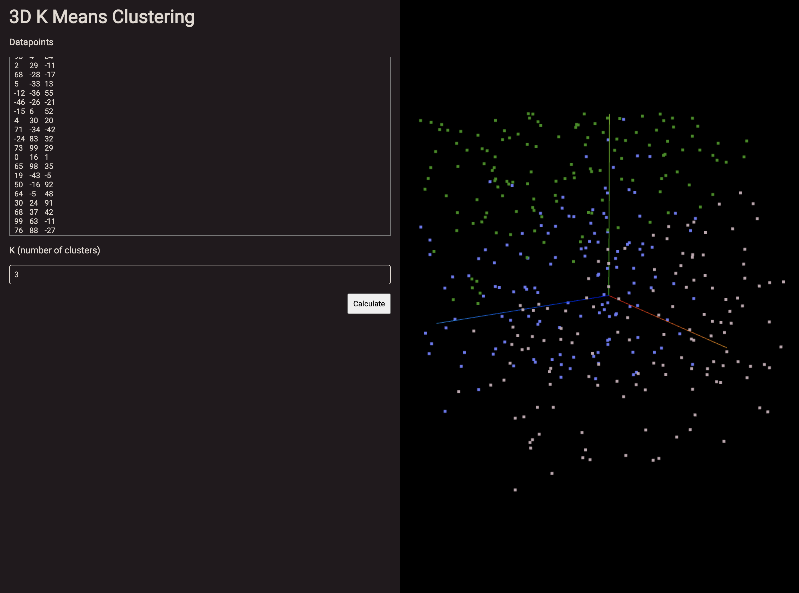

# K-Means-Visualize

## About

K-Means-Visualize is an Angular SPA to visualize a k-means cluster for a set of 3 dimensional data points.



## Running locally

1. Clone the repository and install dependencies.
   ```
   git clone https://github.com/An-Huynh/k-means-visualize
   cd k-means-visualize
   npm ci
   ```

2. Run the `start` script.
   ```
   npm run start
   ```
